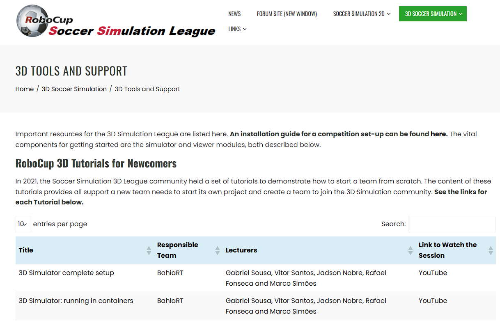

# RoboCup仿真3D中文教程

​	RoboCup仿真3D中文教程（RoboCup Simulation 3D Chinese Tutorial，RCS3D-CT）是介绍RoboCup机器人世界杯中仿真3D比赛的中文教程，主要对比赛的历程和主要内容进行介绍，帮助新参与比赛的队伍了解比赛，并快速上手底层，进行开发。

## 说明📑

> [!CAUTION]
>
> ​	应老师需求，仿真3D比赛需要一本介绍比赛和底层的中文教材。自去年10月准备编写RoboCup仿真3D教材，但意志不坚定，工作量较大，技术更新较快，个人难以完成，遂产生此不完整的材料😔，后面可能也不会再次添加。但写了不能浪费，可以用作后续参考。本README将简要介绍已完成教程的部分，以及未完成部分所预期内容。接着，介绍历届RoboCup比赛情况和可作参考的资料。最后，会写一些个人觉得有用的内容:D。

## 文档介绍✒

​	在写作时，首先在markdown上进行写作，之后复制到word中，每完成一章复制到word中。目前已完成前四章的内容，因此有四个md文件，对应四个章节，最后把目前[word](word/RoboCup仿真3D中文教程word版.docx)中的内容转为了[PDF](pdf/RoboCup仿真3D中文教程pdf版.pdf)。

**[第一章 机器人与机器人足球](仿真机器人教程-第1章.md)**：本章在设计时是为传统教材的前言部分，主要介绍机器人的起源和发展，其中特别介绍了RoboCup机器人世界杯这一赛事，以及各组别的简要情况。

**[第二章 仿真足球系统](仿真机器人教程-第2章.md)**：本章以仿真足球系统为切入点，介绍了进行机器人仿真的流程和基本原理。比较了主流仿真系统之间的差异，并重点介绍了RoboCup仿真3D比赛所采用的仿真引擎--SimSpark以及使用该引擎开发的比赛环境--RCSSServer3D。其中重点介绍了RCSSServer3D仿真环境的安装和使用，并介绍了比赛环境中较为重要的概念(如感知器及其相关语法格式等)。最后，为新加入比赛的团队，推荐了目前开源的底层代码，来帮助他们了解并快速上手比赛。

**[第三章 系统结构与模块](仿真机器人教程-第3章.md)**：以UT Austin Villa 3D团队开源的底层代码为例，介绍主要的结构和仿真比赛运行流程。介绍了底层代码主要的功能模块，其中包含了进行仿真3D比赛所需要实现的完整功能，帮助读者理解仿真比赛的运行流程。

**[第四章 机器人模型](仿真机器人教程-第4章.md)**：介绍了仿真机器人的主要参数信息和不同异构机器人的区别，并利用机器人状态空间，所能够实现的功能。

​	下面是未完成部分：

**第五章 机器人世界模型**：机器人世界模型(WorldModel)是机器人感知世界的中间方式，通过构建机器人世界模型，能够实现从传感器到具体信息的转变。本章可以介绍构建世界模型的方式和主要内容、如何定位自身、如何确定自身状态等，从而为后续高级行为提供数据支撑。

**第六章 机器人动作设计及优化**：机器人的各关节变化组成一个机器人动作，机器人动作是比赛中的重要的评估标准。从头部旋转定位球、到设计关键帧实现简单踢球、再到扑球等都较为复杂。如何在仿真比赛中设计一个动作、利用的工具，以及如何对其进行优化。或者不通过具体设计利用深度强化学习，让机器人自行探索实现令人惊艳的效果。

**第七章 机器人高级行为与团队决策**：各机器人信息不直接共享，如何实现团队间的合作。利用世界模型提供的信息，构建高级团队决策，实现11名球员的角色分配、传球点或者其他方式。

**附录 实验**：为帮助新团队实现快速上手，设计合适的实验，在实践中了解仿真3D。

## 历届比赛情况🏆

​	[RoboCup机器人世界杯](https://robocup.org)至今已举办多年，大约每年7月份举办，举办地点每年不同。仿真3D比赛作为最古老的赛事之一，自2004年来目前共举办了21届，其中最多时来自全世界各地区的三十多支队伍同台竞技。近些年，不少队伍退出了比赛，而且由于参赛壁垒较高，很多新队伍想参加但也望而却步。（这也是本教程最初出现的原因，希望能够降低比赛入门难度）。

​	RoboCup仿真3D比赛中获得世界冠军最多的队伍是[UT Austin Villa 3D](https://github.com/LARG/utaustinvilla3d)(C++语言)，其在2011至2021的10年之间获得了9次世界冠军，一次世界亚军，并在2016年开源了其底层代码。在此之后，国内很多队伍都基于其底层进行开发，国赛(即RoboCup机器人世界杯中国赛)上持续了几年参赛队伍均为UT底层的情况。

​	在2021年和2023年，[MagmaOffenburg](https://github.com/magmaOffenburg/magmaRelease)(Java语言,Python版本构建中)和[FC Portugal](https://github.com/m-abr/FCPCodebase)(Python语言)团队分别开源了其底层代码，为仿真3D比赛注入了活力，他们也分别是近三年世界杯比赛的冠亚军。近两年，国赛上百花齐放，不少新队伍也加入了仿真3D大家庭，极大地促进了比赛的进步和技术的迭代。目前国赛上，三种开源底层均有出现，也有不少优秀的队伍开源了相关成果，为新队伍提供了良好的示范。

## 可做参考的资料📚

​	以下整理了一些可做参考的资料，供读者自行查阅。

### 官方资料

​	[RoboCup仿真3D官网](https://ssim.robocup.org/3d-simulation/3d-tools)为新参与的队伍提供了相关教程，包括比赛环境的安装、往年比赛日志、交流群等，相关介绍如下：

- **RoboCup 3D Tutorials for Newcomers**：提供了相关视频教程，教学仿真环境的安装、magmaOffenburg团队底层介绍和UT Austin Villa 3D团队底层介绍。
- **RoboCup 3D Organizing Committee [guide](https://github.com/david-simoes-93/RCSoccerSim3dSetup)**：提供了组织一场完整仿真3D比赛的教学，包括电脑参数、文件系统、代理配置等。
- **RoboCup Competitions [archive](https://archive.robocup.info/Soccer/Simulation/3D/)**：记录了仿真3D历年比赛的团队描述文档、二进制文件、比赛回放等。
- **SimSpark and RCSS Server 3D [repository](https://gitlab.com/robocup-sim/SimSpark)**：仿真3D比赛环境的官方存储库，每次server版本更新会在此更新。
- **Client Agent Proxy [repository](https://github.com/magmaOffenburg/magmaProxy)**：为解决智能体不同步而设计的代理的存储库。
- **RoboViz [repository](https://github.com/magmaOffenburg/RoboViz)**：RoboViz比赛监视器的存储库。
- **Community communication**: [Discord server](https://discord.gg/RKtyE99wnJ)比赛交流社区。
- **3D Agent Source-Code Releases**：开源底层代码存储库。
- **3D Gazebo Plug-In [repository](https://bitbucket.org/osrf/robocup3ds)**：Gazebo挑战，现已取消。
- **Soccer Simulator 3D/Simspark [wiki](https://gitlab.com/robocup-sim/SimSpark/-/wikis/home)**：仿真3Dwiki百科。

### 论文资料

每年RoboCup比赛除比赛外，会开展[RoboCup国际会议](https://dblp.org/db/conf/robocup)，探讨相关学术研究，邀请各赛道冠军撰写冠军论文(Champion Papers)并出版。

UT Austin Villa 3D团队：[UT Austin Villa 3D Simulation Publications](https://www.cs.utexas.edu/~AustinVilla/sim/3dsimulation/publications.html)

magmaOffenburg团队：[出版物 --- Publikationen](https://magma.hs-offenburg.de/publikationen)

FC Portugal团队：暂无官方合集

### 国内教学视频

UT Austin Villa 3D:

- [南京邮电大学Apollo3D](https://space.bilibili.com/1731152676)
- [合肥工业大学HFUTEngine](https://space.bilibili.com/1847515850)+[【RoboCup3D】HFUT-RoboCup3D寒假培训 week1_哔哩哔哩_](https://www.bilibili.com/video/BV1wf4y1C7Qv/?spm_id_from=333.1387.homepage.video_card.click&vd_source=401ecefef3816b4b7e3372dff7a963c4)

magmaOffenburg:

- [安徽大学DreamWing3D](https://space.bilibili.com/1573851225)

FC Portugal:

- 暂无

### GitHub开源

- [TansirFlow](https://github.com/TansirFlow)

- [Jiangtianjian](https://github.com/Jiangtianjian)

## 最后🙏

编者能力有限，还请包涵！感谢国内外参与RoboCup3D比赛的全体成员！

