# RoboCup仿真3D

## 第一章  机器人与足球机器人

本章主要介绍了机器人的起源、发展历程与相关应用，以及发展过程中出现的突破性技术，并单独设置两小节介绍本书主要面向的足球机器人赛事的基本情况与技术发展。机器人领域经过半个世界的飞速发展，目前已形成了一个庞大的产业。在工业上，已经出现不少可替代人类工作的机器人案例，正在改变人类的生产生活方式。近些年，随着人工智能相关研究的飞速进步，更是加快了机器人领域的发展。大模型的涌现又激发了社会对机器人的再一次热情，人形机器人、具身智能等方向的火热也引发了人们对未来机器人的美好畅想。机器人走进社会、家庭等真实生活场景，真正的服务人类等场景将不再只是文字的描述。甚至是在几十年后，在草地上和机器人进行一场势均力敌的足球比赛！

### 1.1 机器人的起源与背景

从早期文明开始，便有人类根据自己的想象力创造出他们想象中的物品。

我国古代劳动人民根据他们的智慧就创造出一些帮助他们生产的机器。东汉时期的张衡，精通天文历算，制造了以水力驱动的“浑天仪”，发明了世界第一部验证器“候风地动仪”，以及“指南车”等具有实用价值的工具。三国时期诸葛亮在北伐时所使用的帮助人搬运物品的机器人：木牛流马，能够运输四百斤以上的粮食，每日行程为“特行者数十里，群行三十里”，这可以认为是早期的四足机器人。

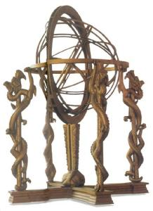

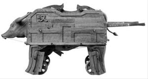

在国外，公元前2世纪也出现了类似的工具或者机械。亚历山大时期的赫罗（Hero of Alexandria）是一位著名的工程师和数学家，他发明了许多基于蒸汽、空气和水压的装置，其中一些被认为是最早的自动机。古希腊传说中希腊联军躲藏在巨大的“特洛伊木马”腹中潜入特洛伊城，夜深人静时，潜伏的士兵离开木马，打开城门，使联军攻下了特洛伊城，可以说是机器人在军事领域的应用。

虽然机器人的起源建立起许多历史产物上，但真正意义上的机器人直到20世纪之后才被发明出来。“机器人"(Robot)一词来源于1920年捷克斯洛伐克的作家卡佩克所写的一本科幻小说，叫《罗萨姆的机器人万能公司》(Rossum's Universal Robots)。这本小说中他构思了一个和幻想了一个名为罗伯特的机器人，也就是我们英文中的Robot，它可以不吃饭，能够不知疲劳的，不知疲倦地进行工作。在第一次世界大战以后，是各国工业发展比较迅速的时期，电影《摩登时代》，卓别林主演的机器人，在生产线中天天的进行劳动，人们在这种烦躁的体力劳动中就幻想有一种能代替人完成这样工作的想象。所以”机器人“这一个词体现了人类长期的一种愿望，这种愿望就是创造出一种机器，能够代替人进行各种工作。之后随着工业技术的发展，各种机械、电气自动化技术的出现，也逐渐推动了机器人的发展，形成了现在的机器人学。

### 1.2 机器人的定义与发展历程

现在谈到机器人，可能可以想象出一个具体的事物，但机器人到底是什么？大多数人可能不太清楚。国际上对机器人主要的定义有如下几种：

①国际标准化组织（ISO）对机器人的定义，其定义较为全面和准确，涵盖如下内容：

​	a.机器人的动作机构具有类似于人或其他生物体某些器官（肢体、感官等）的功能；

​	b.机器人具有通用性，工作种类多样，动作程序灵活易变；

​	c.机器人具有不同程度的智能性，如记忆、感知、推理、决策、学习等；

​	d.机器人具有独立性，完整的机器人系统在工作中可以不依赖于人。

②美国机器人工业协会（RIA）对机器人的定义。机器人是“一种用于移动各种材料、零件、工具或专用装置的，通过可编程的动作来执行各种任务的具有编程能力的多功能机械手”。这个定义叙述具体，更适用于对工业机器人的定义。

③日本工业机器人协会（JIRA）对机器人的定义。它将机器人分成两类：工业机器人是“一种能够执行与人体上肢（手和臂）类似动作的多功能机器”；智能机器人是“一种具有感觉和识别能力，并能控制自身行为的机器”。

④国际机器人联合会(IFR)对机器人的定义。机器人是一种半自主或全自主工作的机器,它能完成有益于人类的工作,应用于生产过程中的称为工业机器人,应用于家庭或直接服务人的称为服务机器人,应用于特殊环境的称为专用机器人(或特种机器人)。

⑤英国《牛津简明英语词典》对机器人的定义。机器人是“貌似人的自动机，是具有智力且顺从于人但不具有人格的机器”。这是一种对理想机器人的描述，到目前为止，尚未有与人类在智力上相似的机器人。

以上是学术上对机器人的定义，对于一般人可能比较晦涩难懂。而根据人们一般的理解，机器人是具有一些类似人的功能的机械电子装置或者叫自动化装置，它仍然是个机器。只不过它具有一些特点：第一个特点是机器人具有类人的功能，比如说作业功能、感知功能、行走功能等，还能完成各种动作；第二个特点是机器人根据人的编程能自动的工作。这是一个显著也是最实用的特点，就是它可以编程，改变它的工作、动作、工作的对象和工作的一些要求，它是人造的机器或机械电子装置；第三个特点是能够感知环境，能够有学习、情感和对外界一种逻辑判断思维。这个特点是从更加完整深远的角度对机器人所提出的更加高层次的要求，它能够感知环境代替人类工作。这里更加强调的是机器人智能，比方说机器人在这里边可以代替人进行焊接，焊接的环境是非常复杂的，可以搬运，它在生产线中搬运玻璃和各种各样的一些零件的搬运的工作，等等，这都是把人从繁重的体力劳动中解放出来的例子。

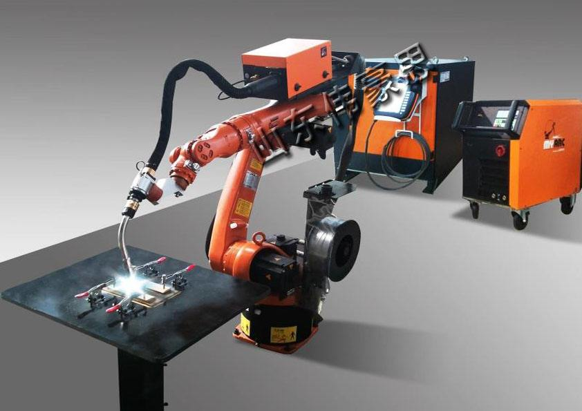

对什么是机器人有了一定的概念后，我们来了解下机器人的发展历程。从目前来看，我们把机器人分为三个发展阶段，也就是，我们习惯于把机器人分成三类：

一种是第一代机器人，也叫作示教再现型机器人。1947年，为了搬运和处理核燃料，美国橡树岭国家实验室研发了世界上第一台遥控的机器人，1962年美国又研制成功PUMA通用示教再现型机器人，来帮助人类进行工作。它是通过一个计算机，来控制一个多自由度的一个机械，通过示教存储程序和信息，工作时把信息读取出来，然后发出指令，机器人可以重复的根据人当时示教的结果，再现出这种动作。这种机器人是最早的机器人工作模式，几乎所有的工业机器人都配备这种工作模式。例如汽车的点焊机器人，只要把这个点焊的过程示教完以后，它总是重复这样一种工作。但这种工作模式也存在着缺陷，它对于外界的环境没有感知，这个力操作力的大小，这个工件存在不存在，焊的好与坏，这个时期的机器人人本身是无法感知的。

第二种机器人叫做感觉型机器人。20世纪70年代后期，人们开始研究第二代机器人，称为带感觉的机器人，这种带感觉的机器人是类似人在某种功能的感觉，比如说力觉、触觉、滑觉、视觉、听觉和人进行相类比，有了各种各样的感觉，比方说在机器人抓一个物体的时候，它实际上力的大小能感觉出来，它能够通过视觉，能够去感受和识别它的形状、大小、颜色。抓一个鸡蛋，它能通过一个触觉，知道它的力的大小和滑动的情况；

第三代机器人，也是我们机器人学中一个理想的所追求的最高级的阶段，叫做智能机器人。这种机器人带有多种传感器，可以进行复杂的逻辑推理、判断和决策，在变化的内部状态和外部环境中，自主决定自身的行为。只要告诉它做什么，不用告诉它怎么去做，它就能完成运动，感知思维和人机通讯的这种功能和机能。这类机器人目前的发展还是相对的只是在局部有这种智能的概念和含义，但真正完整意义的这种智能机器人实际上并没有存在，并且随着我们不断的科学技术的发展，智能的概念越来越丰富，它内涵越来越宽。

在过去的三四十年里，机器人学与机器人技术经历了迅猛的发展，其应用已渗透至工业、科技、教育及国防等多个领域。同时，在学术界也孕育出了一门新兴学科——机器人学。随着当代计算机技术和人工智能的飞跃进步，机器人的功能与技术层级显著提升，智能化趋势日益凸显，人工智能技术也被广泛应用到机器人学中。机器人技术的发展潜力正在不断拓展，可以预见，在不久的将来，机器人技术将成为全球各地区发展的焦点。

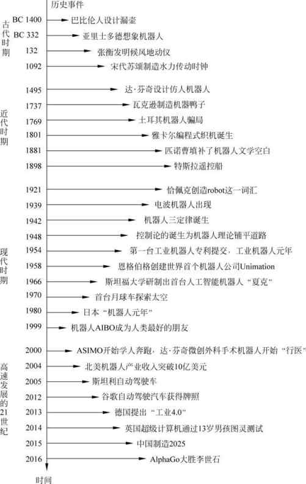

### 1.3 机器人的分类与应用

按照应用领域、结构形式、运动方式等角度，可以将机器人进行较为全面的分类。

（1）根据应用领域分类：

根据机器人的应用领域可以分为工业机器人、服务机器人和特种机器人。

①工业机器人还可分为焊接机器人、搬运机器人、装配机器人、喷涂机器人等。其中焊接机器人是目前工业界应用最多的机器人，因人类进行焊接工作具有一定的危险性，目前大型工厂中的大型零件的焊接工作已经采用机器人完成，用于实现自动化焊接工作，提高焊接效率。装配机器人常用于电子器件或电路板的电子元件的装配，例如国内嘉立创公司所提供的自动焊接服务，该过程中便采用了这种机器人能够快速将指定的电子原件放置到电路板指定位置。工业机器人的特点是稳定性高、可靠性好、高安全性与高重复性，核心技术包括高性能工业机器人系统的设计、精确的运动控制、参数修改与可编程性、协同工作等。

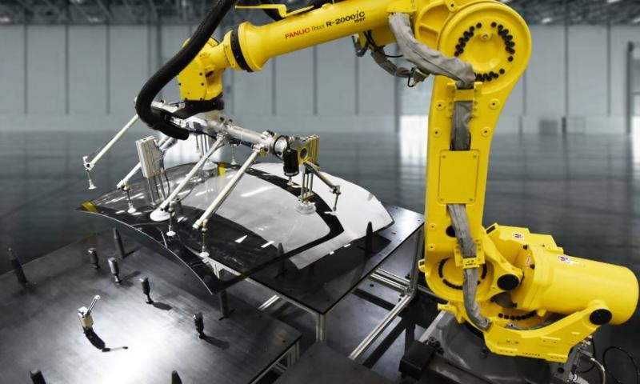

②服务机器人的应用比较广泛，主要为公众或者个人提供服务的机器人均属于该范畴。在商场、商城等购物地点帮助选购商品的导购机器人，在展览会会场、办公大楼、旅游景点为客人提供信息咨询服务的迎宾机器人,在政府机关、博物馆、旅馆等各种公共场所进行接待的接待机器人,在旅游景点、展览馆进行导游导览的导游机器人，在加油站能够自动对汽车进行加油操作的加油机器人等。随着机器人技术的发展，未来肯定会有更多类型更多功能的机器人走进我们的日常生活，进入我们的家庭为我们服务。

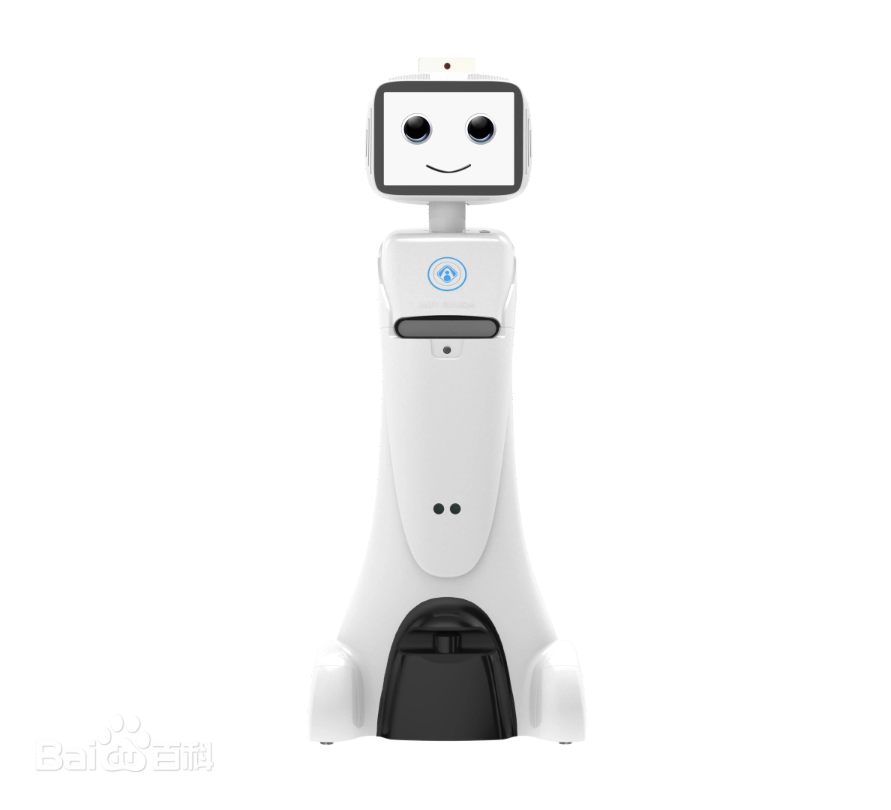

近些年随着语言大模型的提出，相关研究人员将大模型的理解能力与机器人融合在一起，通过给出相应的指令，机器人能够自主分析理解指令，将任务进行分解，自主控制机器人关节角度，结合视觉、雷达等多模态信息，做出决策实现指令，并具有一定的泛化能力。这一方向的发展也使得沉寂了多年的机器人领域再次火热，初创的机器人公司也如雨后春笋一般出现，并以极快的速度迭代，产生了不少令人惊艳的产品，也吸引着更多能人志士投身机器人行业。

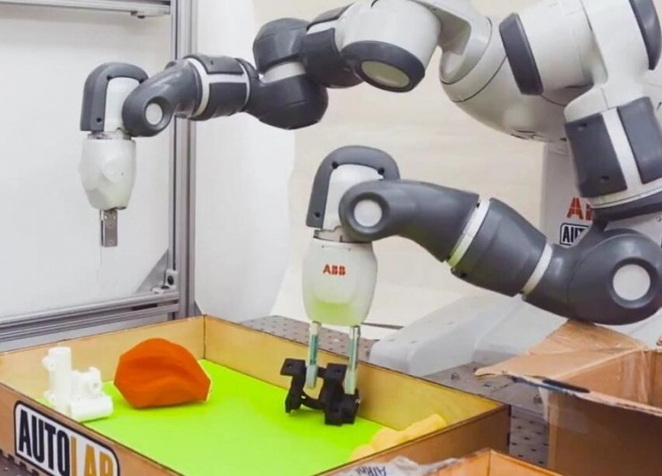

③特种机器人主要用于军事、消防、救援等特殊场景与核工业、航海、航天等极限环境，替代人们在极端环境下执行特定任务。第一代机器人--示教机器人产生的原因便是帮助人类在核试验时运送核原料。但由于特种机器人应用场景的特殊性，该类型的机器人往往开发技术门槛高、研发周期长、研发成本高等特点，这也一定方面限制了该类型机器人技术的迭代。

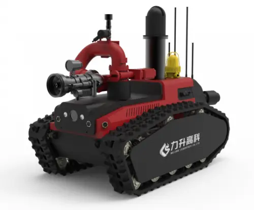

（2）根据结构形式分类：

①多关节机器人是应用较为广泛的工业机器人类型之一。它的机械结构类似于人的手臂。臂通过扭转接头连接到底座。连接臂中连杆的旋转关节的数量可以从两个关节到十个关节不等，每个关节提供额外的自由度。接头可以彼此平行或正交。具有六个自由度的关节机器人是较常用的工业机器人，因为其设计提供了非常大的灵活性。关节机器人的主要优势为其可高速进行运作和其占地面积非常小。

②平面多关节机器人具有圆形工作范围，由两个平行关节组成，可以在选定的平面上提供适应性。旋转轴垂直定位，安装在手臂上的末端执行器水平移动。平面多关节机器人专门从事横向运动，主要用于装配应用。与圆柱坐标型和笛卡尔机器人相比，平面多关节机器人可以更快地移动并且更容易集成。

③并联机器人也被称为平行连杆机器人，因为它由和公共底座相连的平行关节连杆组成。由于直接控制末端执行器上的每个关节，末端执行器的定位可以通过其手臂轻松控制，从而实现高速操作。并联机器人有一个圆顶形的工作空间。并联机器人通常用于快速取放或产品转移应用。其主要功能有抓取、包装、码垛和机床上下料等。

④直角坐标机器人也称为直线机器人或龙门机器人，具有矩形结构。这些类型的工业机器人具有三个棱柱形关节，通过在其三个垂直轴（X、Y和Z）上滑动来提供线性运动。他们可能还附有手腕以允许旋转运动。笛卡尔机器人在大多数工业应用中使用，因为它们在配置方面提供了灵活性，使其适合特定的应用需求。笛卡尔机器人可提供高定位精度以及其可承受重型物件。

⑤圆柱坐标型机器人在底座处具有至少一个旋转关节和至少一个连接连杆的棱柱形关节。这些机器人有一个圆柱形工作空间，带有一个枢轴和一个可垂直和滑动的可伸缩臂。因此，圆柱形结构的机器人提供垂直和水平线性运动以及绕垂直轴的旋转运动。手臂末端的紧凑设计使工业机器人能够在不损失速度和可重复性的情况下到达紧凑的工作范围。它主要用于拾取、旋转和放置材料的简单应用。

⑥协作机器人是旨在在共享空间中与人类互动或在附近安全工作的机器人。与传统的工业机器人相反，传统的工业机器人旨在通过与人的接触隔离来确保安全地自主工作。协作机器人安全性可能取决于轻质的结构材料，倒圆的边缘以及速度或力的限制。协作服务机器人可以执行各种功能，其中包括公共场所的信息机器人；在建筑物中运输物料的物流机器人，以检查配备有摄像头和视觉处理技术的机器人，这些机器人可以在多种应用中使用，例如在安全设施的外围巡逻。协作型工业机器人可用于自动化重复的，不符合人体工程学的任务-例如，取放重型零件，机器进给和最终组装。

（3）根据驱动方式分类：

①液压驱动系统：液压技术是一种比较成熟的技术，具有动力大、力(或力矩)与惯量比大、快速响应高、易于实现直接驱动等特点。适于在承载能力大、惯量大以及在防焊环境中工作的机器人中应用。不过液压系统需进行能量转换(电能转换成液压能)，速度控制多数情况下采用节流调速，效率比电动驱动系统低。液压系统的液体泄泥会对环境产生污染，工作噪声也较高。因这些弱点，近年来，在负荷为100千克以下的机器人中往往被电动系统所取代。下图为波士顿动力采用液压驱动的人形机器人。

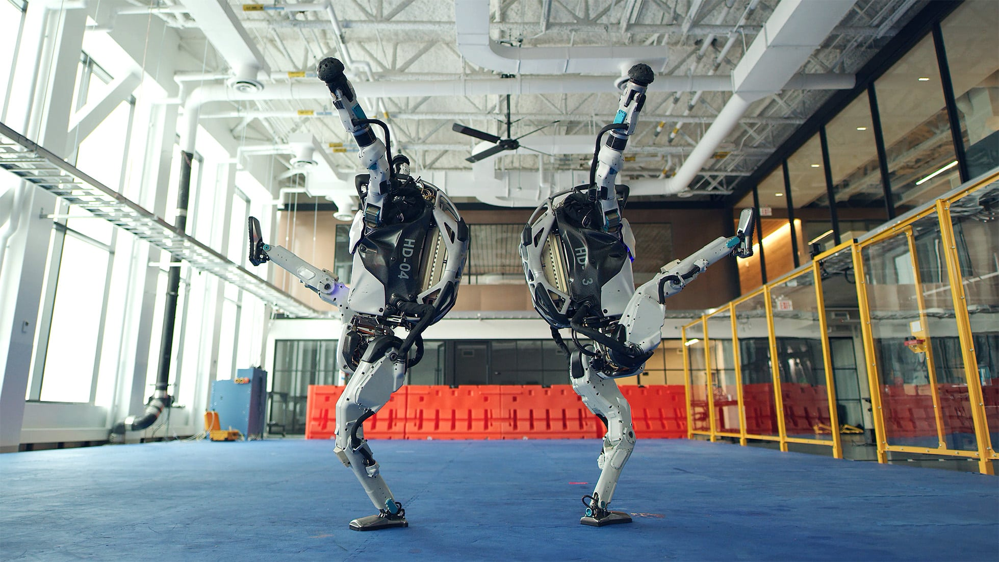

②气动驱动系统具有速度快、系统结构简单、维修方便、价格低等特点。适于在中、小负荷的机器人中采用。但因难于实现伺服控制，多用于程序控制的机械人中，如在上、下料和冲压机器人中应用较多。

③电动驱动系统由于低惯量、大转矩交、直流伺服电机及其配套的伺服驱动器（交流变频器、直流脉冲宽度调制器）的广泛采用，这类驱动系统在机器人中被大量选用。这类系统不需能量转换，使用方便、控制灵活。大多数电机后面需安装精密的传动机构。直流有刷电机不能直接用于要求防爆的环境中，成本也较液压、气动两种驱动系统高。但因这类驱动系统优点比较突出，因此在机器人中被广泛的选用。

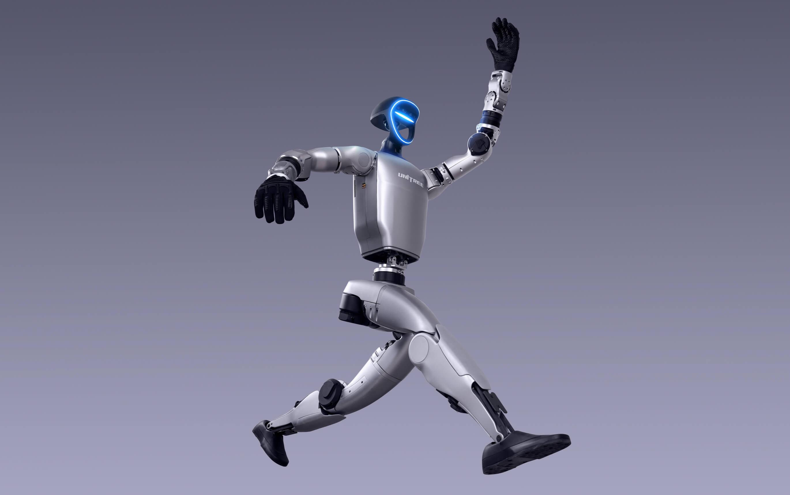

### 1.4 机器人的主要技术

机器人领域涉及多种跨学科的技术，经过几十年的发展，机器人领域已经发展成一个较为成熟的学科。同时作为控制对象的机器人既可以是物理实物对象，也可以是数学模型。对应地，也提供两种对象，一个是对机器人设计并研制，一个是根据机器人运动学和动力学建立数学模型。鉴于研发实体机器人需要大量资金，研发周期长，机器人容易损耗等特点，近些年来，在对机器人研发过程中，往往先借助计算机建立机器人的数学模型，采用虚拟对象进行闭环控制。这一过程称为仿真，主要用来对关节算法进行原理性验证。之后在实体机器人中进行实验验证，实验成功后的方法便可应用在实际中。

机器人学基础理论包括机器人运动学和机器人动力学,主要是基于力学原理,采用数学的方法,对机器人的运动规律、激励特性进行描述,建立相应的数学方程。这是机器人知识体系中最基本的部分,是相应方法的支撑条件。

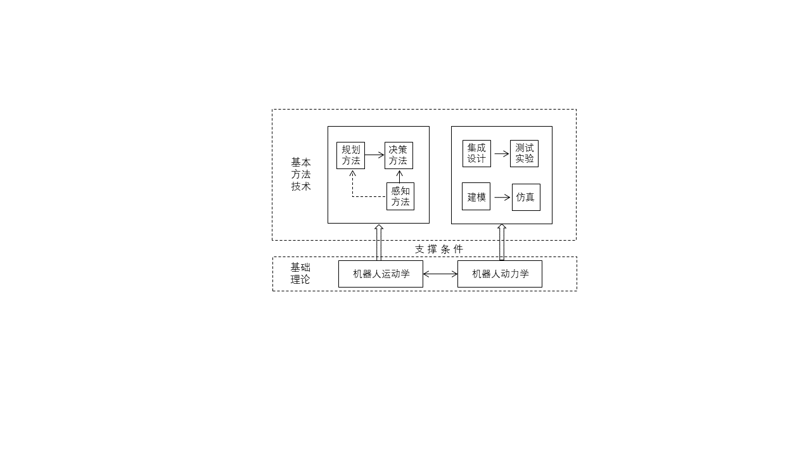

在此基础之上，发展出了机器人学的基本方法和相应实现的技术，主要包括感知技术、决策技术、驱动技术、交互技术以及目前较为前沿的技术。

（1）感知技术：机器人需要通过各种传感器来获取环境信息。常见的传感器包括但不限于以下几个方面：视觉感知方面，使用摄像头捕捉图像，并通过图像处理技术如滤波、边缘检测、图像分割等来提取信息。正如人类通过视觉获取信息大约占比60%，视觉信息也是目前智能机器人获取信息的主要方式；激光雷达，用于测距和构建三维地图在视觉受限环境下，机器人感知的另一个方式是使用雷达进行环境感知；超声波传感器，常用于短距离测距；其他传感器：包括红外传感器、温度传感器、压力传感器等。上述感知技术往往并不是仅使用一种，在机器人中通常综合多种形式的传感信息，实现对周围信息的最大可能感知。

（2）决策技术：这是指机器人如何基于感知到的信息做出决策的技术，主要包括：规划算法，帮助机器人确定达到目标的最佳路径；机器学习，尤其是强化学习方面，使机器人可以从经验中学习并改进自身行为。这一方面目前也在机器人步态规划方面大放异彩，不少新兴的机器人公司采用强化学习技术训练出非常稳定的机器人步态算法，使得机器人能够在各种不同的地形环境依然保持稳定的行为。

（3）驱动技术：涉及到机器人如何执行任务所需的硬件和技术，包括：电机驱动，控制机器人的运动部件；力学结构，设计机器人的物理构造，确保其结构强度和灵活性；中央控制器，算法运行的平台，接受传感器信号，控制各个关节运动角度，是机器人的大脑。

（4）交互技术：使机器人能够与人类或其他设备进行有效的沟通，包括：语音识别与合成，允许机器人理解和产生语音，近些年火热的语言大模型首先在这一方面实现突破，使得机器人直接理解人类指令并自主做出决策称为可能；人机交互界面，设计易于使用的界面供人类与机器人互动，机器人设计的目的是为人类服务，设计合理、便于使用的交互界面也是机器人应用的重要技术。

（5）前沿技术：随着技术进步，新的前沿技术不断出现，这些对机器人未来的形式和发展方向提供了无线的想象例如：柔性机器人技术，使用软材料制作更安全且适应性强的机器人；脑机接口技术，实现人类大脑与机器直接通信；虚拟现实机器人技术，结合虚拟现实技术来增强人机交互体验；自动驾驶技术，不仅限于汽车，也应用于机器人导航和定位。

### 1.5 机器人足球的起源与发展

 	“机器人足球”这一概念是由机器人足球是由加拿大大不列颠哥伦比亚大学教授Alan Mackworth首次提出，在1992年的一次国际人工智能会议上他的团队发表了一篇题为“On Seeing Robots”的论文，其中首次提到了机器人踢足球的想法。他的目的是想通过机器人足球比赛，为人工智能和智能机器人学科的发展，提供一个具有标志性和挑战性的课题。他和他的学生们还就他们机器人足球项目发表了一系列的文章。此想法一经提出，便得到了各国科学家的普遍赞同和积极响应，国际上许多著名的研究机构和组织开始进行研究,将其付诸实现并不断推动其发展。

1992 年 10 月，一组日本研究人员在东京独立组织了一次人工智能重大挑战研讨会，讨论可能的重大挑战问题。这次研讨会引发了关于利用足球运动促进科学和技术的严肃讨论。进行了一系列调查，包括技术可行性研究、社会影响评估和财务可行性研究。此外，还起草了规则，以及足球机器人和模拟器系统的原型开发。作为这些研究的结果，研究人员得出结论，该项目是可行且可取的。1993 年 6 月，包括浅田稔、国芳康雄和北野浩明在内的一群研究人员决定发起一项机器人比赛，暂定名为机器人 J-League（J-League 是新成立的日本职业足球联赛的名称）。然而，不到一个月，他们就收到了来自日本国外研究人员的压倒性反应，要求将该计划扩展为国际联合项目。因此，他们将该项目更名为 Robot World Cup Initiative，简称“RoboCup”。

在进行这次讨论的同时，一些研究人员已经将足球比赛作为他们研究的领域。例如，日本政府研究中心电工实验室 （ETL） 的 Itsuki Noda 正在使用足球进行多智能体研究，并开始开发足球比赛的专用模拟器。这个模拟器后来成为 RoboCup 的官方足球服务器。大阪大学Minoru Asada 教授的实验室、卡内基梅隆大学的Manuela Veloso 教授和她的学生Peter Stone一直在独立地研究踢足球的机器人。

1993 年 9 月，该倡议首次公开宣布，并起草了具体法规。因此，在许多会议和研讨会上就组织和技术问题进行了讨论，包括 AAAI-94、JSAI 研讨会以及各种机器人学会会议。

在 1995 年 8 月于加拿大蒙特利尔举行的人工智能国际联合会议 （IJCAI-95） 期间，宣布与 IJCAI-97 名古屋联合组织第一届机器人世界杯足球赛和会议。同时，决定组织 Pre-RoboCup-96，以识别与大规模组织 RoboCup 相关的潜在问题。我们决定提供两年的准备和开发时间，以便最初的一组研究人员可以开始机器人和仿真团队的开发，并为他们的资助计划提供准备时间。

Pre-RoboCup-96 于 1996 年 11 月 4 日至 8 日在大阪举行的智能机器人与系统国际会议 （IROS-96） 期间举行，八支队伍进行了模拟联赛和中型联赛的真实机器人演示。虽然规模有限，但本次比赛是首次利用足球比赛促进研究和教育的比赛。

经过数年的准备，第一届机器人足球世界杯于1997年8月25日在日本名古屋举办，同期国际最高级别的人工智能学术会议--国际人工智能联合大会（IJCAI-97）一并举行。来自美、欧、日、澳的40多支球队参加了比赛（真实和模拟相结合），超过 5000 名观众观看了比赛。

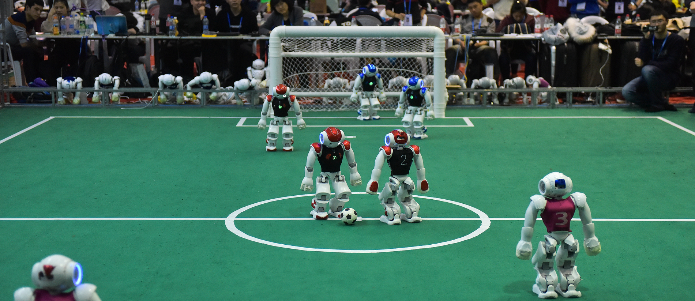

通过提供具有公众吸引力但艰巨的挑战， RoboCup 将作为促进机器人和 AI 研究的工具。促进科学和工程研究的有效方法之一是设定一个具有挑战性的长期目标。当实现这样一个目标具有重大的社会影响时，它被称为大挑战项目。建造一个踢足球的机器人本身不会产生重大的社会和经济影响，但这一成就肯定会被认为是该领域的重大成就。我们称这种项目为地标性项目。RoboCup 是一个具有里程碑意义的项目，也是一个标准问题。

RoboCup组织在创办之初便确定了其最终目标：

”*到 21 世纪中叶，一支由完全自主的人形机器人足球运动员组成的团队将赢得一场足球比赛，这支球队将遵守 FIFA 的官方规则，与最近一届世界杯的获胜者对决。*“

毋庸置疑，最终目标的实现需要数十年的努力。以目前的技术在不久的将来实现这一目标是不可行的。但是，这个目标很容易导致一系列方向明确的子目标。在 RoboCup 中要实现的第一个子目标是“建立真实的软件和软件机器人足球队，这些球队在修改后的规则下踢得相当好。实现这一目标，无疑也会产生技术，将影响广泛的行业。

| 序号   | 举办时间 | 举办地点                 |
| ------ | -------- | ------------------------ |
| 第1届  | 1997     | 日本名古屋               |
| 第2届  | 1998     | 法国巴黎                 |
| 第3届  | 1999     | 瑞典斯德哥尔摩           |
| 第4届  | 2000     | 澳大利亚墨尔本           |
| 第5届  | 2001     | 美国西雅图               |
| 第6届  | 2002     | 日本福冈                 |
| 第7届  | 2003     | 意大利帕多瓦             |
| 第8届  | 2004     | 葡萄牙里斯本             |
| 第9届  | 2005     | 日本大阪                 |
| 第10届 | 2006     | 德国不来梅               |
| 第11届 | 2007     | 美国亚特兰大             |
| 第12届 | 2008     | 中国苏州                 |
| 第13届 | 2009     | 奥地利格拉茨             |
| 第14届 | 2010     | 新加坡                   |
| 第15届 | 2011     | 土耳其伊斯坦布尔         |
| 第16届 | 2012     | 墨西哥墨西哥城           |
| 第17届 | 2013     | 荷兰埃因霍温             |
| 第18届 | 2014     | 巴西若昂佩索阿           |
| 第19届 | 2015     | 中国合肥                 |
| 第20届 | 2016     | 德国莱比锡               |
| 第21届 | 2017     | 日本名古屋               |
| 第22届 | 2018     | 加拿大蒙特利尔           |
| 第23届 | 2019     | 澳大利亚悉尼             |
| 第24届 | 2020     | 法国波尔多（因疫情取消） |
| 第25届 | 2021     | 线上                     |
| 第26届 | 2022     | 泰国曼谷                 |
| 第27届 | 2023     | 法国波尔多               |

中国队伍在各届赛事的表现：

**2006年中国队情况**

由范长杰、吴锋等7名在校学生组成的中国科技大学队在6月14日至18日德国第十届机器人世界杯足球赛上，获得1项冠军、1项亚军和1项第五名，创造了自2000年中国派队参加机器人世界杯赛以来最好成绩。来自全球的200多所大学参加了这届机器人世界杯足球赛7个大项的比赛。

**2010年中国夺冠**

2010年6月，北京信息科技大学“Water”队在新加坡举行的中型机器人足球世界杯赛中战胜以博士生、硕士生和本科生混合编组的上届冠军荷兰爱因霍夫理工大学队取得冠军，为国家争得了荣誉，并在2011年成功卫冕。

**2011年中国队情况**

北京信息科技大学Water队获得机器人足球赛中型组冠军。

**2012年中国队情况**

北京信息科技大学Water队获得机器人足球赛中型组季军。

**2013年中国队情况**

2013年6月24—6月30日在荷兰埃因霍温举行的第17届Robocup机器人RoboCup机器人世界杯中型组比赛中，中国北京信息科技大学机器人足球队“Water”，经过三轮小组循环赛和四强淘汰赛共13场比赛的激烈角逐，决赛中通过加时以3：2的比分战胜卫冕冠军、东道主荷兰埃因霍温理工大学队，再次夺得“世界杯”冠军，实现了四届比赛三夺桂冠的壮举。

中国队共获得三项世界杯冠军：

北京信息科技大学机器人足球队“Water”队夺得中型组冠军

浙江大学ZjuNlict队夺得小型组夺冠

南京邮电大学Apollo3D夺得3D仿真组冠军

**2014年中国队情况**

中国科学技术大学蓝鹰队夺得家庭服务机器人组的冠军。这是亚洲队伍首次在此项目夺得冠军**。**

浙江大学 ZJUNlict小型组冠军。 

北京信息科技大学Water队获得中型组冠军。

**2015年中国队情况**

RoboCup来到中国，比赛地点在合肥，北京信息科技大学“Water”队再次夺得中型组冠军。

**2016年中国队情况**

2016年6月，第20届机器人世界杯中，浙江大学ZJUNlict队获得机器人足球赛小型组季军。

2016年6月，第20届机器人世界杯中，北京信息科技大学Water队获得机器人足球赛中型组亚军。

**2017年中国队情况**

2017年7月，第21届机器人世界杯中，浙江大学ZJUNlict队获得机器人足球赛小型组季军。

2017年7月，第21届机器人世界杯中，北京信息科技大学Water队获得机器人足球赛中型组冠军。

**2018年中国队情况**

2018年6月，第22届机器人世界杯中，同济大学TJArk队获得机器人足球赛标准组季军。

2018年6月，第22届机器人世界杯中，浙江大学ZJUNlict队获得机器人足球赛小型组冠军。

2018年6月，第22届机器人世界杯中，北京信息科技大学、Water队获得机器人足球赛中型组季军。

**2019年中国队情况**

2019年7月，第23届机器人世界杯中，浙江大学ZJUNlict队获得机器人足球赛小型组冠军。

2019年7月，第23届机器人世界杯中，北京信息科技大学Water队获得机器人足球赛中型组亚军。

2019年7月7日，2019年机器人世界杯正在澳大利亚悉尼举行。2019 RoboCup机器人世界杯中型仿人机器人组的决赛，唯一一支代表中国出战该组别比赛的之江实验室ZJLabers队以1：3惜败伊朗MRL-HSL队，夺得亚军。

2019年7月2日至8日，2019年机器人世界杯在澳大利亚悉尼举行，清华大学联合组成的Hephaestus（火神队）最终斩获人形组三项大奖，包括AdultSize的Technical Challenge 技术挑战赛亚军、Drop-in比赛亚军，以及2VS2足球比赛季军。

2019年7月7日，平均年龄还不足14岁的合肥铁榔头机器人战队，摘得本届大赛RMRC项目的世界冠军。RMRC是快速制造救援机器人挑战赛项目的简称，参赛队伍自行设计制作救援机器人，要求能在在碎石、杂草、台阶、废墟等复杂地形环境下，执行侦测、识别幸存者等救援任务。

### 1.6 目前机器人足球的主要赛事

目前国际上主要两项知名的机器人足球赛事--RooCup机器人世界杯中国赛、FIRA机器人足球比赛，并在不同地区和国家举办对应的区域赛与选拔赛，每年吸引着全世界超过50个国家近一万名参赛队员参与比赛。

（1）**RoboCup机器人世界杯**

RoboCup机器人世界杯是目前国际上最知名、历史最悠久、影响力最深远、覆盖范围最广的机器人赛事之一，也是机器人足球概念的起源之处。目前RoboCup机器人世界杯已发展成影响全球50多个国家和地区的国际性机器人赛事。除RoboCupSoccer(机器人足球)这一最经典的赛事外，还拓展出RoboCupRescue(机器人救援)、RoboCup@Home(机器人家庭服务)、RoboCupIndustrial(机器人工业)、RoboCupJunior(机器人青少年)赛事。每种赛事针对的人群和方向有所不同，在本书中主要介绍经典的RoboCupSoccer机器人足球赛事。

机器人足球赛事经过多年的发展，目前共有五种赛事类别：

①类人组：在类人组(Humanoid)比赛中，具有类似人类的身体结构和类似人类的感官的自主机器人相互踢足球。与类人组比赛之外的人形机器人不同，感知和世界建模的任务并没有通过使用非人类类测距传感器来简化。除了足球比赛外，还会进行技术挑战。在保持平衡的同时动态行走、奔跑和踢球、对球、其他球员和场地的视觉感知、自我定位和团队合作是类人组比赛调查的众多研究问题之一。世界上最好的几款自主人形机器人参加了 RoboCup 人形机器人联赛。除此之外，在该组别赛事中，根据机器人的大小又分为KidSize、TeenSize和AdultSize三个子联赛。该组别联赛是目前最接近RoboCup最终目标(赢得人类比赛)的赛事。

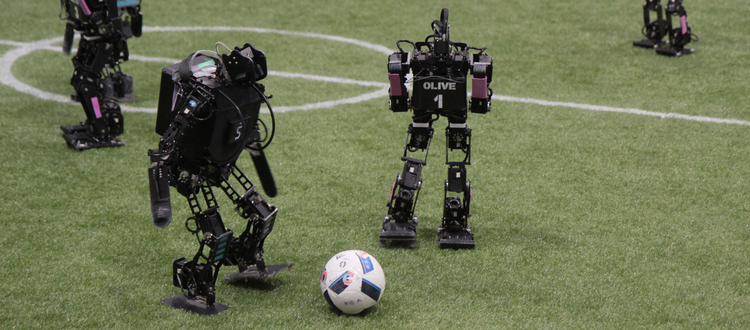

②标准平台组：RoboCup 标准平台联赛(SPL)是一项 RoboCup 机器人足球联赛，所有球队都使用相同的机器人进行比赛。机器人完全自主运行，即无需人工或计算机外部控制。当前使用的标准平台是 Aldebaran的人形 NAO。该联赛的研究重点是完全自主机器人的算法开发。在每年的 RoboCup 上，该组别都会举办一场足球队比赛和几项技术挑战赛。在 RoboCup 2023 上，足球队比赛将在冠军杯组进行 7 对 7 的比赛，在挑战盾组进行 5 对 5 的比赛。同时，RoboCup 2023 的技术挑战包括视觉裁判挑战、动态控球挑战和至少一项游戏内挑战。

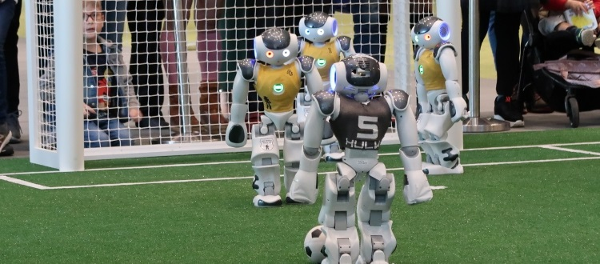

③中型组：在 RoboCup中型组(MSL)中，由 5 个完全自主机器人组成的团队使用常规尺寸的 FIFA 足球踢足球。团队可以自由设计自己的硬件，但所有传感器都必须板载，并且机器人有最大尺寸和重量限制。研究重点是计划和感知层面的机电一体化设计、控制和多智能体合作。

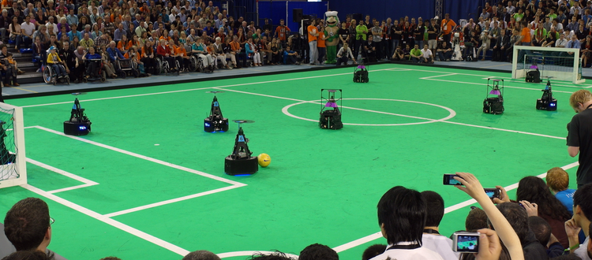

④小型组：RoboCup 小型联赛(SSL)是历史最悠久的 RoboCup 足球联赛之一。它专注于在高度动态的环境中进行智能多智能体协调和控制。球队目前使用橙色高尔夫球参加 11 对 11 场足球比赛（B 组 6 对 6 场）。机器人由团队构建，必须符合规则中定义的特定尺寸和约束。场上的所有物体都由一个中央视觉系统（称为SSL-Vision）进行跟踪，该系统由 SSL 社区维护。每个团队的场外计算机用于协调和控制机器人所需的处理。通信是无线的，并使用专用的商用无线电发射器/接收器单元。

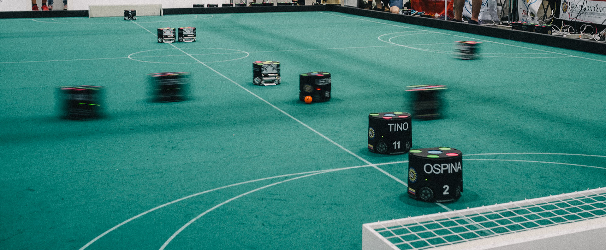

⑤仿真组：RoboCup仿真联赛(SSIM)是RoboCupSoccer 中最古老的联赛之一。仿真联赛专注于人工智能和团队战略。独立移动的软件玩家（代理）在计算机内的虚拟场地上踢足球。该联赛分为仿真2D比赛与仿真3D比赛，顾名思义两者的维度不同。在仿真2D比赛主要针对机器人团队策略与多智能体方面研究，仿真3D比赛除团队策略外，更加注重机器人本身的运动控制与自主决策。鉴于比赛基于计算机模拟，比赛门槛相对较低，成本较低，富含趣味性，吸引了众多学生和研究学者参与，是目前所有联赛中参与人数最多的联赛。机器人仿真3D也是本书主要的讲述对象。

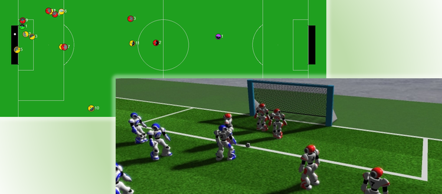

**RoboCup机器人世界杯中国赛：**

 RoboCup机器人世界杯中国赛（RoboCup China Open）是RoboCup机器人世界杯的正式地区性赛事，1999年中国自动化学会举办了首届RoboCup机器人世界杯中国赛，并于2006年发展为RoboCup 国际联合会认定的最有影响力的五大国际区域赛之一。同年开始，该项赛事每年与“中国机器人大赛”合并举办，冠名为“中国机器人大赛暨RoboCup机器人世界杯中国赛”，赛制为每年举办一次。
作为我国面向大学生、研究生开展，影响力最大、综合技术水平最高的机器人学科竞赛之一，致力于推进机器人相关学科，特别是自动化、机器人、人工智能等学科的发展。大赛由中国自动化学会主办，由在RoboCup国际联合会任职的中国高校教授、学者具体组织，大赛顾问由十多位自动化领域的知名院士、专家组成，借助于中国自动化学会在自动化、机器人与人工智能领域的强大影响力和专业实力，大赛的技术水平和学术水平得到了高校广泛认可。赛制为每年举办一次，至今已成功举办22届。

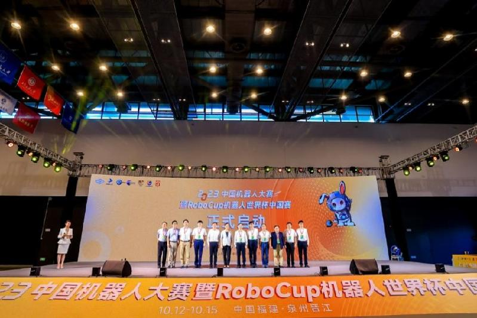

RoboCup机器人世界杯中国赛的比赛项目基本与世界赛一致，还增加了机器人舞蹈、太空机器人之战、灵巧控制等项目，每年根据世界赛的要求修改对应规则。作为RoboCup机器人世界杯的区域性赛事，该赛事也承担着选拔优秀队伍参加机器人世界杯的任务。每年各赛事的优胜者将代表中国前往世界各地征战机器人世界杯，为国争光！

（2）**FIRA国际机器人赛事：**

国际机器人运动协会联合会 （FIRA） 由韩国科学技术院的 Jong-Hwan Kim 教授于 1996 年创立，是世界上历史最悠久的机器人足球比赛。目前已有30余个国家的近百个学校与科研院所是FIRA的成员单位,且主要分布在亚洲、澳洲、北美和南美洲等地区。FIRA 已经发展成为一项重要的机器人竞赛，其目标是将体育作为机器人和其他相关领域最先进研究的基准问题。FIRA 还包括针对自主飞行机器人的 FIRA Air 竞赛、针对具有巨大社会效益的机器人研究（如城市搜救机器人）的 FIRA 挑战赛，以及面向下一代研究人员的 FIRA 青年赛。

FIRA机器人足球比赛与RoboCup机器人世界杯比赛项目有所不同，主要有：半自主型(MiroSot)、全自主型(RoboSot)、类人型(HuroSot)、仿真型(SimuroSot)、超小型半自主型(NaroSot)、超小型全自主型(KheperaSot)等几种类型。

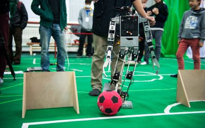

机器人足球比赛是一个富含挑战性的比赛，其内容包括智能感应、智能决策、智能学习等方面。这些方面是人工智能技术的基本内容，也正是因此，机器人足球比赛称为人工智能研究的标准问题。从之前的计算机象棋、围棋，发展到现在的机器人足球问题，将单智能体发展到现在的多智能体，将静态的研究环境发展到动态环境，将非实时处理发展到实时处理，机器人足球的发展推动着人工智能技术的发展。

机器人足球赛事的发展也带动了其他方面的技术应用，近些年火热的人形机器人在机器人足球赛事中早已应用，并发展到了一定的深度，也一定程度上推动了相关技术在产业上的落地与推广。无论是现实世界中的智能机器人或机器人团队(如家用机器人等)，还是网络空间中的软件自主体(如用于网络计算和电子商务的各种自主软件)，都可以抽象为具有自主性、社会性、反应性和能动性的“智能体”(agents)。这其中的主要问题是智能体与智能体、智能体与人之间的协调与发展，主要研究内容包括智能体设计、多智能体分布式系统结构、智能体协作、推理与知识获取等方面。上述方面在机器人足球中都得到了体现，将机器人足球作为人工智能与机器人学的标准问题十分恰当，对此的研究有着重大意义。经过数十年的发展，在个别领域也已经验证这一问题。希望未来机器人足球赛事能够发展地越来越好，实现最初的理想目标！
